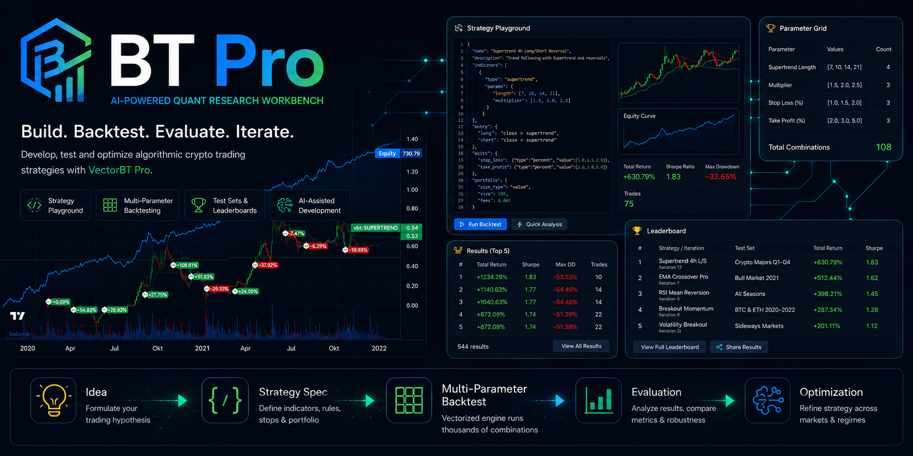

# BT Pro App - Workbench and GUI for VectorBT Pro

*Deutsche Fassung: [README.md](README.md)*

**Research workbench for iteratively developing and backtesting algorithmic crypto trading strategies** — built on [VectorBT Pro](https://vectorbt.pro/).

Core workflow: formulate a strategy idea → define parameters → run a backtest against historical price data → evaluate the result → refine the hypothesis → repeat.

The actual goal is **AI-assisted strategy development**: instead of coding every backtest by hand, you give the AI an assignment: *"Build a strategy from these indicators, this is the entry signal, this is the exit signal, and test it with the standard test set"*. The AI creates the strategy, runs multi-parameter backtests, evaluates the results and optimizes across market phases and symbols. The app provides the tools (playground, test sets, leaderboard), the AI operates them.

The app is **not** a trading platform: it does not execute real trades, has no broker connection and no live order management. It is a place to measure, compare and systematically improve strategies. Fully optimized strategies are handed over to a separate system for live execution.

> **Note on language:** The app's user interface is in German. The AI works in any language — simply give it your instructions in English.


## Example prompt

Hi, I'd like you to research and find a trend-following strategy for trading ETH/USDT.
It has to be a squeeze strategy that uses Bollinger Bands as the base indicator — and of course you can add any
other indicator you consider useful.

From the start of the year until today, the results should have a Sharpe ratio of at least 1.5, with a risk of 3 % of the account per trade.
I want to trade on the 30-minute timeframe. It's fine for you to use the 4-hour timeframe as the anchor (higher) timeframe.

Every time you develop a strategy, validate the result with a statistical significance test before you write the complete
strategy. Only continue if the strategy's metrics show real statistical significance.

Feel free to use optimization to improve the results. Make sure the results are not overfitted.
Keep going until you find strategies that fully meet the required criteria. Don't interrupt me with questions in the meantime.

## Operate the entire app with AI

The example prompt above is the big assignment — but the AI can do far more than that: **everything you can click in the user interface, it can do for you.** Create strategies, define indicators and rules, set up parameter grids, load price data, start backtests and test set runs, evaluate and compare results. You don't need to know a strategy's JSON spec or fill in a configuration by hand.

**How to get started:**

1. Install and start the app (see [Installation](#installation-local)).
2. Open your AI in the project folder — Claude Code finds the bundled skill on its own; for other AI tools, pass them the skill folder (see [step 4](#4-skill---connect-your-ai)).
3. Say in your own words what you want to have or see tested. The AI creates everything needed, starts the runs and reports the result back to you.

**Example assignments:**

- *"Download ETHUSDT and SOLUSDT on the 1-hour timeframe."*
- *"Create a strategy for me: enter when the RSI(14) drops below 30 and price is above the EMA 200. Exit when the RSI rises above 70. Stop loss 2 %. Save it as a setup."*
- *"Test RSI lengths from 7 to 21 and EMA lengths from 100 to 300 in steps of 50."*
- *"Create a test set with BTC, ETH and SOL on 4h, each from 2022 to 2024, and run the strategy against it."*
- *"Show me the five best combinations by Sharpe with at least 30 trades."*
- *"Is the best result statistically significant or just chance?"*
- *"Compare the current iteration with the previous one."*
- *"Take a look at this: http://localhost:5570/…"* — you can simply give the AI the address of a page from the app, and it reads the object behind it on its own.

**Two ways of working:** The AI handles individual assignments like the ones above step by step and reports back afterwards. If you give it a **goal** instead — as in the example prompt — it works autonomously in loops: research, build a strategy, test, evaluate, improve, until the goal is reached or it stops with a reason.

Everything the AI creates shows up in the user interface immediately and can be edited there — and conversely, the AI finds everything you created by hand.

## What you can do with the app

The user interface is built for **viewing, checking and comparing**. Creating things is best left to your AI — it knows the indicators, their parameters and the rule syntax you would otherwise have to learn first.

### Setup — the AI creates your strategy

This is the standard way of working: you tell the AI in your own words what you want to test, and have it save the result as a **setup**.

- *"Build me a strategy for ETHUSDT on 1h: enter when the EMA 20 crosses the EMA 50 from below and the RSI is below 70. Exit on the opposite cross, stop loss 2 %. Save it as a setup."*

A setup captures everything that belongs to the strategy: market data, indicators with their values, entry and exit rules, stops and how it is displayed in the chart. Every setup has its own address — you open it in the playground and see the strategy in the chart right away.

This makes the setup the **handover point between you and the AI** — in both directions. If you changed something in the playground, save it as a setup and say: *"Take a look at setup 12 and test the EMA lengths."*

### Chart Playground — view and fine-tune in the chart

In the playground you see what the strategy does:

- **Quick backtest with one click:** the trades appear directly in the chart, together with the equity curve. You see immediately whether the idea holds up at all.
- **Change values and recalculate:** adjust parameters, switch off individual rule blocks or indicators to try things out, change stops — and see the result right back in the chart.
- **Display as you like:** color, line style and width of every line; channels appear as filled bands, zones as areas. Each indicator can calculate on its own timeframe (e.g. a 4h trend filter in the 30-minute chart).
- **Tools in the chart:** ruler for measuring price distances, show and hide long/short separately, switch to the next symbol with an arrow.

Of course you can also click a strategy together entirely by hand in the playground — indicators from all libraries that ship with VectorBT Pro, rules with AND and OR. But that is tedious and requires you to know the indicators and their parameters well.

### Indicator configuration — test many parameters at once

Instead of trying each setting individually, you specify a range of values for each parameter — e.g. EMA length from 10 to 100 in steps of 5. A **multi-parameter run** then calculates every combination, including the stops. The app counts the combinations for you beforehand. Thanks to VectorBT Pro this is fast: around 30,000 combinations over two years of price data in about 15 minutes.

You save the value ranges as an **indicator configuration**, market and portfolio (symbol, period, starting capital, position size, fees) as a **backtest configuration**. Both are independent of the strategy — the same strategy can be run with any values and against any market.

### Test sets — check across markets and periods

A strategy that only works on BTC over the last year is worth little. A **test set** groups several backtest configurations — different symbols, bull and bear phases, sideways markets — and runs your strategy against all of them under identical conditions with one click. The base installation comes with ready-made test sets.

### Evaluate results

- **Runs:** all runs with status and progress, running and completed.
- **Results:** every single parameter combination with metrics such as return, Sharpe, drawdown, profit factor and win rate — filterable, sortable and stored permanently. You mark good results with a star.
- **Analysis of a run:** summary, top 10, distribution of wins and losses, heatmaps (also in 3D) — so you can see whether good values form a stable plateau or are just a random outlier.
- **Single result in detail:** chart with all trades, equity and drawdown, full statistics, trade, order and position lists. With **Walk Forward** you check with one click how the same values would have performed in the following 3, 6 or 12 months. "In Playground öffnen" (open in playground) takes you straight back to the chart.

### Develop and compare strategies

- **Concepts and iterations:** a **concept** is your trading idea, an **iteration** a concrete version of it. Every change to the strategy becomes a new iteration referencing the previous one — you can always trace which result belongs to which version and return to an older one.
- **Leaderboard:** a ranking in which you compare strategies and iterations over long, comparable periods — sortable by return, Sharpe, drawdown and more. This is how entries get in: tick **"Leaderboard-Eintrag erstellen"** (create leaderboard entry) on the test set. Every completed run of that test set then automatically lands in the leaderboard — with the best parameter combination per market and the aggregated metrics across all markets of the set.

### Around the app

- **Price data:** download and update any Binance symbols and timeframes, no API key needed. The download runs in the background.
- **Job overview:** shows which workers are currently calculating and which jobs are still waiting.
- **Database backup:** save the current state (strategies, configurations, results) with one click and restore it later.
- **Knowledge index:** your strategy notes (Obsidian vault) are made searchable so the AI can draw on earlier findings for new assignments.


*Chart Playground — central workspace*

| | |
|:---:|:---:|
| **Strategy concepts & iterations** | **Backtest configurations** |
|  |  |
| **Indicator configuration** | **Runs (backtest runs)** |
|  |  |
| **Results (single results, filterable and sortable)** | **Manage OHLC data** |
|  |  |
| **Run analysis (metrics, distributions, top 10 & parameter heatmaps)** | |
|  | |

---

## Requirements

What you need to bring yourself to run the app locally:

- **Docker + Docker Compose.** The standard setup is **Windows with Docker Desktop** (that is what `install.bat` is built for); Linux/macOS run via `install.sh`.
- **Your own VectorBT Pro license with GitHub access** (see below).

### VectorBT Pro — required external framework

**VectorBT Pro is not part of this repo** and is not shipped with it — it is a commercial, paid product from [vectorbt.pro](https://vectorbt.pro/). You need your **own VBT Pro license** with access to the private GitHub repo `polakowo/vectorbt.pro`. This repo only contains references that pull the framework from the original source during the build — you have to obtain the framework code yourself.

How to get access:

1. **Purchase a license** at [vectorbt.pro](https://vectorbt.pro/) — your GitHub account is then invited to the private repo `polakowo/vectorbt.pro`.
2. Add an **SSH key** to GitHub that has this access (the build pulls VBT Pro via `git+ssh`).

The VBT framework base image is built **separately** (not via Compose — a Compose build with a build secret aborts the buildx bake step). The key is passed as a BuildKit secret and never ends up in the image:

```bash
# Native Linux/macOS:
services/vbt/build.sh ~/.ssh/<keyname>

# WSL + Docker Desktop (key via UNC path, since the Windows engine does not translate /mnt paths):
services/vbt/build.sh '\\wsl.localhost\<Distro>\home\<user>\.ssh\<keyname>'
```

This creates the image `bt_pro_app_v1-vbt:latest`, which Compose then uses as its base.

---

## Installation (local)

### 1. Create `.env`

```bash
cp .env.example .env
```

The defaults are set so that the system runs locally right away. The only required entry: `VBT_SSH_KEY` — the path to the SSH key used to pull the VBT Pro framework during the build (WSL notes in the [Requirements](#vectorbt-pro--required-external-framework) section).

### 2. Install

```bash
install.bat           # Windows (Docker Desktop, native)
./install.sh          # Linux / macOS
```

One call does everything: build the VBT Pro base image, start the containers, create the database schema and the base installation (backtest configs + test sets + demo strategy). The schema is created automatically when the container starts — no manual migration step needed.

> **Caution — fresh installation:** `install.sh`/`install.bat` delete the existing database and app state (configs, strategies, runs, leaderboard, queue, pgAdmin) before rebuilding, and ask for confirmation first. Price data (`data/ohlc_data`) is kept.

### 3. Open the app

After a short startup time the app is available (the app container migrates the database automatically on startup):

| Service | URL | Description |
|---|---|---|
| Installation overview | http://localhost:5570/install | Starting point after installation: installation check and loading price data (see step 5) |
| App / frontend | http://localhost:5570 | The actual application: playground, configurations, test sets, leaderboard, backtest evaluation |
| pgAdmin | http://localhost:5563 | Web interface for managing the PostgreSQL database |
| PostgreSQL | localhost:5560 | Direct database access (e.g. for external tools) |

### 4. SKILL - connect your AI

The AI operates the app via the bundled skill folder **`.claude/skills/ds-strategie-session/`** — it contains the development loop (`SKILL.md`) and `scripts/toolbox.py`, which creates, starts and reads every app object (iterations, configs, runs, results, test sets, leaderboard) via the API.

Claude Code finds the folder in the project root on its own; for other AI tools, place it wherever they expect their skills. Nothing else is needed: `toolbox.py` only needs a `python3` without additional packages and talks to `http://localhost:5570` by default (different port via `VBT_APP_BASE_URL`).

### 5. Finish the setup

Open the **installation overview** at [http://localhost:5570/install](http://localhost:5570/install):

- **Installation check** — shows what the base installation brought along: backtest configs, test sets and a demo strategy as a starting example.
- **Load OHLC** — **the first way is the AI:** tell it "Download BTCUSDT on the 4-hour timeframe", it has the tools for that and handles the download. **The second, manual way** is via **Konfiguration → OHLC-Daten** (Configuration → OHLC data). The button here on the installation overview is the quick start: it creates the download jobs for the symbols of the bundled test sets (Binance, one background job per symbol; symbols already present are skipped). After that, backtests and the demo strategy are ready to run.
- **The first backtest takes longer** — VectorBT Pro compiles its Numba functions on the first call and caches them. This happens separately per process: once on the first real run (run/result, which runs asynchronously in the worker) and once on the first quick backtest in the playground (which runs synchronously in the frontend process, not in the worker). Every further run in the respective process then runs at full speed.

---

## Data source

OHLCV data (open, high, low, close, volume) is loaded from **Binance** via the VectorBT Pro downloader (historical public data, no API key needed) and stored as HDF5 files under `data/ohlc_data/` — read directly from the file system during backtests, no DB round trip for price data.

**File ownership in the bind mount:** the HDF5 files are created by the worker and then written by both app and worker (download, update, delete symbol). For this to work, all containers that write to `data/ohlc_data`, `user_data` or `services` run as `uid:gid 1000:1000` — this is set in `docker-compose-local.yml` (`app`, `worker`, `worker-init`, `vbt`). If even one of them ran as root, `root:root` files with mode 644 would be created that the other containers can no longer write (error: "file … exists but it can not be written"). If your host user does not match 1000:1000 (`id -u` / `id -g`), enter your values there.

If `root`-owned files have already ended up in the mount (e.g. from an older installation), fix them once:

```bash
docker exec -u 0 frontend_bt_pro_v1 chown -R 1000:1000 /app/data/ohlc_data /app/user_data /app/services
```
---

## Technical reference

### Tech stack (in the container)

You don't need to install these components yourself — they live inside the Docker containers. Reference only:

| Component | Technology |
|---|---|
| Backend | Python 3.13 + FastAPI |
| Backtest engine | VectorBT Pro |
| Database | PostgreSQL 17 + TimescaleDB + pgvector |
| Job queue | Redis + RQ |
| Frontend | Tabler (Bootstrap 5) + DataTables + LightweightCharts |
| Container | Docker Compose |

### Architecture (short overview)

```
Browser ── HTTP ──> FastAPI (app) ──> PostgreSQL/TimescaleDB
                         │
                         └── Redis queue ──> RQ worker ──> Spec runner
                                                              │
                                  OHLCV (HDF5) ──────────────┘
```

Flow of an asynchronous backtest: define a setup → `POST /api/backtest/start` → FastAPI creates a `BacktestRun` and puts the job into the Redis queue → the RQ worker executes the spec runner (load OHLCV → calculate indicators → evaluate rules → `Portfolio.from_signals`) → results in PostgreSQL → the frontend polls the status. The quick backtest in the playground (`POST /api/chart-playground/run-backtest-lite`), in contrast, calculates synchronously and without writing to the DB — for quick visual checks directly in the chart.

Services (`docker-compose-local.yml`): `vbt` (framework base image), `app` (FastAPI), `worker` (RQ), `scheduler` (reindex jobs), `db` (PostgreSQL/TimescaleDB), `redis` (queue), `pgadmin`.

### Project structure

```
services/api/        FastAPI backend (routes, schemas, worker tasks)
services/vbt/        VBT framework base image + knowledge indexer
services/frontend/   Tabler/DataTables templates + static files
services/scheduler/  Scheduler (reindex jobs)
user_data/           Strategy definitions, spec runner, custom indicators
tests/               pytest suite
alembic/             DB migrations
documentation/       Project, knowledge, changelog and git docs
```

---

## Further documentation

| Document | Content |
|---|---|
| `documentation/project/projekt.md` | Detailed project briefing (purpose, features) — in German |
| `CHANGELOG.md` | Release history — in German |

---

## Out of scope

Live trading / order execution, multi-tenant / user accounts, production trading with risk management. The app is deliberately a single-user research workbench.

---

## Disclaimer

BT Pro App is an **experimental research tool** for developing and backtesting trading strategies. It is intended solely for educational and experimental purposes and does **not constitute investment advice**.

All generated strategies and metrics are based on **simulated or hypothetical backtest results**. These do not represent actual trading and may differ significantly from reality: they are created with the benefit of hindsight and do not, or only partially, account for factors such as lack of liquidity, slippage or execution delays.

**Past or simulated performance is not a reliable indicator of future results.** Trading financial instruments involves substantial risk of loss.

Use is entirely at your own risk. **No guarantee whatsoever** is given for the accuracy, completeness or suitability of the results, and **no liability** is accepted for trading losses or other damages arising from the use of this software or the strategies developed with it.

---

## Third parties

- **Lightweight Charts™** © TradingView, Inc. — charting library under Apache License 2.0, included via CDN. The charts show the TradingView attribution logo with a link to [tradingview.com](https://www.tradingview.com/). Full notices: [`NOTICE`](NOTICE).
- **Apache ECharts** © The Apache Software Foundation — charting library (analysis view) under Apache License 2.0, included via CDN. See [echarts.apache.org](https://echarts.apache.org/) and [`NOTICE`](NOTICE).
- **TimescaleDB** © Timescale, Inc. — used as a database extension (container image). The core is under Apache 2.0, some features under the **Timescale License (TSL)** — "source available", **not** OSI open source. Self-hosting and own use are permitted; offering TimescaleDB as a database-as-a-service to third parties is prohibited. See [Timescale License](https://github.com/timescale/timescaledb/blob/main/tsl/LICENSE-TIMESCALE).
- **psycopg2-binary** © Federico Di Gregorio et al. — PostgreSQL driver, used as a pip dependency under **LGPL v3**. The source code is public and the module is replaceable via `pip`; the project's own code is not affected. See [psycopg2](https://github.com/psycopg/psycopg2).
- **Font Awesome Free** © Fonticons, Inc. — icon library, included via CDN. The icons are under **CC BY 4.0** (attribution required), the code under MIT, the fonts under SIL OFL 1.1. See [fontawesome.com](https://fontawesome.com/).

---

## License

This project is licensed under the **Apache License 2.0** — see [`LICENSE`](LICENSE).

The license covers only the code of **this** repo. **VectorBT Pro is not covered**: it is a separate, commercial product under its own license and is not in the repo (see [Requirements](#vectorbt-pro--required-external-framework)). Any use of VBT Pro requires your own valid license.

This is an independent project. It is not affiliated with, endorsed or sponsored by VectorBT PRO or Oleg Polakow. VECTORBT® is a registered trademark of Oleg Polakow.
