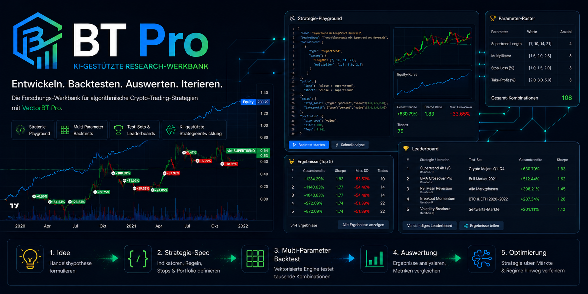
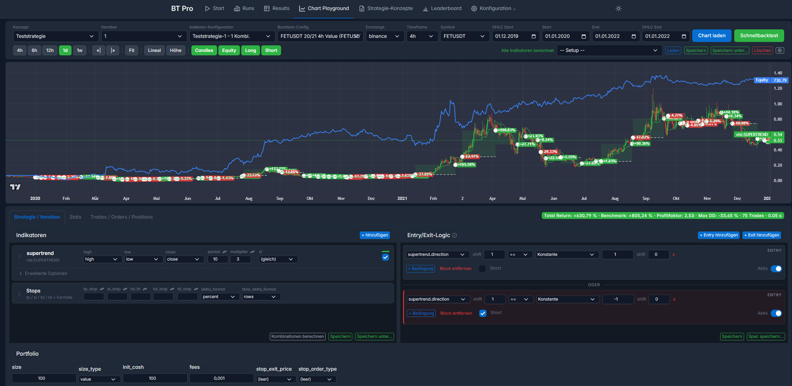
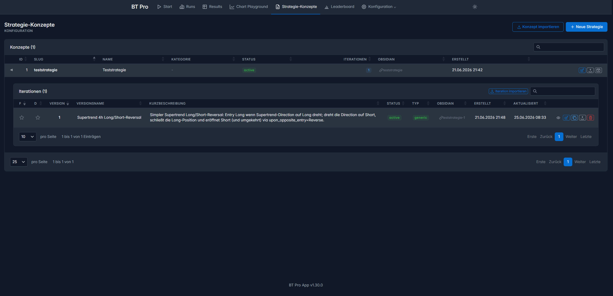
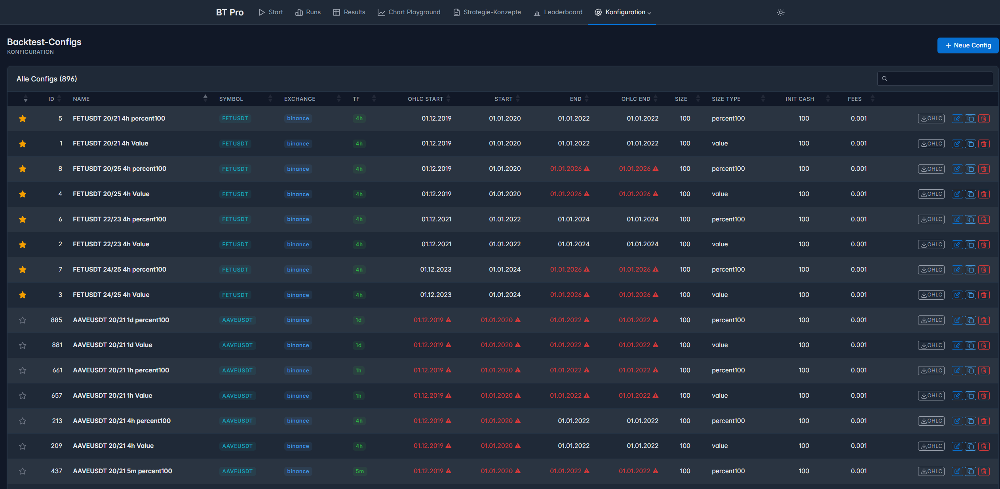
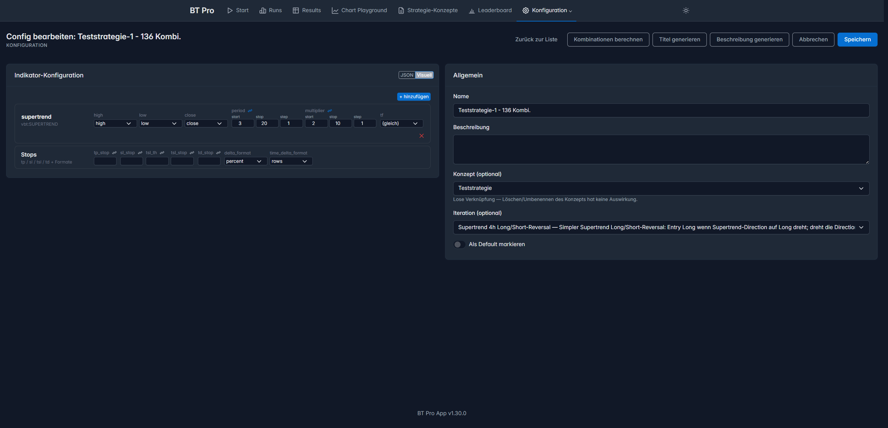
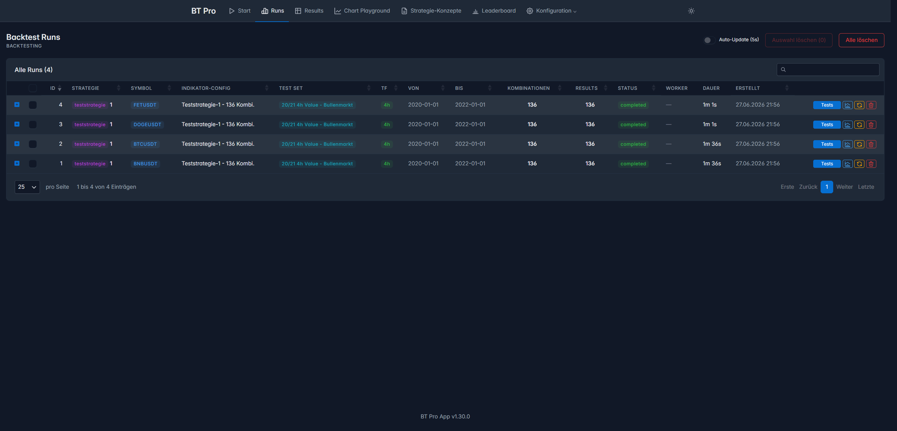
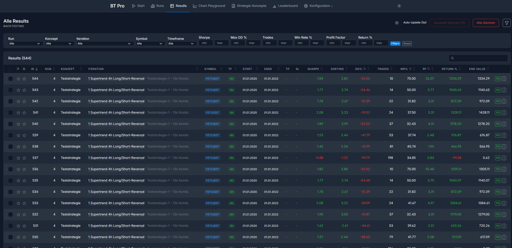
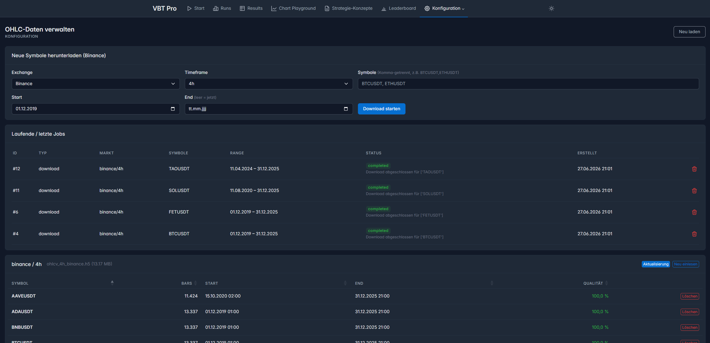

# BT Pro App - Werkbank und GUI für VectorBT Pro

**Research-Werkbank zum iterativen Entwickeln und Backtesten algorithmischer Crypto-Trading-Strategien** — auf Basis von [VectorBT Pro](https://vectorbt.pro/).

Kern-Workflow: Strategie-Idee formulieren → Parameter definieren → Backtest gegen historische Kursdaten ausführen → Ergebnis auswerten → Hypothese verfeinern → wiederholen.

Das eigentliche Ziel ist die **KI-gestützte Strategie-Entwicklung**: Statt jeden Backtest von Hand als Code zu entwickeln, soll man die KI beauftragen: *„Baue eine Strategie aus diesen Indikatoren, das ist das Entry-Signal, das ist das Exit-Signal, und teste sie mit dem Standard-Testset"*. Die KI legt die Strategie an, fährt Multiparameter-Läufe, wertet die Ergebnisse aus und optimiert über Marktphasen und Symbole hinweg. Die App liefert dafür die Werkzeuge (Playground, Test-Sets, Leaderboard), die KI bedient sie.

Die App ist **keine** Trading-Plattform: Sie führt keinen echten Handel aus, hat keinen Broker-Anschluss und kein Live-Order-Management. Sie ist ein Ort, um Strategien zu messen, zu vergleichen und systematisch zu verbessern. Fertig optimierte Strategien gehen an ein separates System zur Live-Ausführung.

---

## Funktionsumfang

- **Chart Playground** — zentraler Arbeitsbereich, in dem eine Strategie als strukturierte JSON-Spec definiert wird (kein Python-Code nötig): Indikatoren, Entry-/Exit-Regeln, Stop-Loss/Take-Profit, Portfolio-Parameter. Direkt im Chart lässt sich ein **Schnellbacktest** fahren (synchron, ohne DB-Schreibvorgang) und das Ergebnis sofort visuell prüfen; die fertige Spec wird als Iteration gespeichert und anschließend als vollständiger, persistierender Lauf gestartet (siehe „Backtest starten"). Dank der vektorisierten VectorBT-Pro-Engine ist das sehr schnell — rund 30.000 Parameter-Kombinationen über einen Zeitraum von zwei Jahren in etwa 15 Minuten.
- **Multiparameter-Läufe** — ein einzelner Lauf spannt ein Parameter-Raster über das Kreuzprodukt mehrerer Werte auf (z.B. 5 SMA-Längen × 3 Multiplikatoren = 15 Kombinationen oder auch 50.000 Kombinationen) 
- **Strategie-Konzepte und Iterationen** — eine **Strategie** (Konzept) ist die Trading-Idee (z.B. eine Teststrategie). Eine **Iteration** ist eine konkrete, versionierte und ausführbare Umsetzung dieser Idee — der vollständige, unveränderliche Snapshot aus Indikatoren und Regeln. Jede strukturelle Änderung erzeugt eine neue Iteration (mit Verweis auf den Vorgänger), sodass jeder Backtest reproduzierbar einer exakten Strategie-Version zugeordnet bleibt.
- **Indikator-Konfiguration** — legt für eine Iteration das **Parameter-Raster** fest, das ein Multiparameter-Lauf abfährt: je Indikator-Parameter ein fester Wert, eine Liste oder eine Range; das Kreuzprodukt ergibt die getesteten Kombinationen. Hier liegen auch die **Stops** (Take-Profit, Stop-Loss, Trailing-Stop, Time-Stop), ebenfalls sweep-fähig. Die Indikatoren selbst sind Teil der Iteration — die Konfiguration bestimmt nur, mit welchen Werten sie durchgerechnet werden.
- **Backtest-Konfiguration** — definiert **Marktdaten und Portfolio** eines Laufs: Symbol, Exchange, Timeframe und Zeitraum sowie Startkapital, Positionsgröße/-typ und Gebühren. Unabhängig von der Strategie — dieselbe Iteration lässt sich gegen beliebige Backtest-Konfigurationen rechnen.
- **Backtest starten** — einen einzelnen Lauf anstoßen: eine Iteration gegen eine gewählte Backtest- und Indikator-Konfiguration rechnen (asynchron über die Queue).
- **Backtest-TestSet starten** — eine Iteration in einem Rutsch gegen alle Backtest-Konfigurationen eines Test-Sets laufen lassen.
- **Runs** — ein Run ist die Ausführung einer Kombination aus **Konzept-Iteration, Backtest-Konfiguration und Indikator-Konfiguration**. Je nach Konfiguration entsteht dabei ein einzelnes Result oder — bei einem Multiparameter-Raster — viele Results in einem Durchlauf. Die Runs-Übersicht zeigt alle Läufe (laufend und abgeschlossen) mit Status und Fortschritt.
- **Results** — ein Result ist das Ergebnis genau einer Parameter-Kombination (Kennzahlen wie Gesamtrendite, Sharpe, Drawdown, Trades). Alle Results bleiben dauerhaft gespeichert und sind durchsuchbar.
- **Test-Sets** — ein Test-Set ist eine benannte Liste mehrerer Backtest-Konfigurationen (z.B. verschiedene Symbole und Marktphasen). Eine Iteration läuft gegen das ganze Set unter identischen Bedingungen — so wird sie über mehrere Szenarien hinweg fair und reproduzierbar bewertet.
- **Leaderboard** — eigene Rangliste zum **Vergleich mehrerer Strategien bzw. Iterationen**. Sie speist sich aus den Ergebnissen von Test-Set-Läufen, deren Test-Set dafür freigeschaltet ist (Opt-in-Flag), und ist sortierbar nach Gesamtrendite, Sharpe, Drawdown u.a.
- **OHLC-Daten-Management** — Kursdaten (OHLCV) werden über die Konfiguration als Hintergrund-Jobs von Binance heruntergeladen oder aktualisiert (`vbt.BinanceData`, asynchron über die RQ-Queue) und als HDF5-Dateien abgelegt; der Job-Status ist nachverfolgbar.
- **Wissens-Index (Vault-Embedding)** — der verknüpfte Obsidian-Vault wird eingebettet und indiziert (PostgreSQL + pgvector); ein Dashboard zeigt Index- und Reindex-Status sowie die indizierten Dateien. Die **semantische Abfrage** selbst läuft (noch) nicht über die Oberfläche, sondern über den Skill `ds-strategie-session` / `toolbox.py` (`knowledge:"…"` → `GET /api/knowledge/search`).


*Chart Playground — zentraler Arbeitsbereich*

| | |
|:---:|:---:|
| **Strategie-Konzepte & Iterationen** | **Backtest-Konfigurationen** |
|  |  |
| **Indikator-Konfiguration** | **Runs (Backtest-Läufe)** |
|  |  |
| **Results (Einzelergebnisse, filter- und sortierbar)** | **OHLC-Daten verwalten** |
|  |  |

---

## Voraussetzungen

Was du selbst mitbringen musst, damit die App lokal läuft:

- **Docker + Docker Compose.** Standard-Setup ist **Windows mit Docker Desktop** (dafür ist `install.bat` gebaut); Linux/macOS laufen über `install.sh`.
- **Eigene VectorBT-Pro-Lizenz mit GitHub-Zugang** (siehe unten).

### VectorBT Pro — notwendiges externes Framework

**VectorBT Pro ist nicht Teil dieses Repos** und wird auch nicht mit ausgeliefert — es ist ein kommerzielles, kostenpflichtiges Produkt von [vectorbt.pro](https://vectorbt.pro/). Du brauchst eine **eigene VBT-Pro-Lizenz** mit Zugriff auf das private GitHub-Repo `polakowo/vectorbt.pro`. Dieses Repo enthält nur Verweise, die das Framework beim Build aus dem Original nachladen — der Framework-Code selbst muss von dir bezogen werden.

So bekommst du den Zugang:

1. **Lizenz erwerben** unter [vectorbt.pro](https://vectorbt.pro/) — danach wird dein GitHub-Account zum privaten Repo `polakowo/vectorbt.pro` eingeladen.
2. **SSH-Key** bei GitHub hinterlegen, der diesen Zugriff hat (der Build zieht VBT Pro per `git+ssh`).

Das VBT-Framework-Basis-Image wird **separat** gebaut (nicht über Compose — ein Compose-Build mit Build-Secret bricht den buildx-bake-Schritt ab). Der Key wird als BuildKit-Secret übergeben und landet nie im Image:

```bash
# Native Linux/macOS:
services/vbt/build.sh ~/.ssh/<keyname>

# WSL + Docker Desktop (Key über UNC-Pfad, da die Windows-Engine /mnt-Pfade nicht übersetzt):
services/vbt/build.sh '\\wsl.localhost\<Distro>\home\<user>\.ssh\<keyname>'
```

Das erzeugt das Image `bt_pro_app_v1-vbt:latest`, das Compose anschließend als Basis nutzt.

---

## Installation (lokal)

### 1. `.env` anlegen

```bash
cp .env.example .env
```

Die Vorgaben sind so gesetzt, dass das System direkt lokal läuft. Einziger Pflicht-Eintrag: `VBT_SSH_KEY` — der Pfad zum SSH-Key, mit dem das VBT-Pro-Framework beim Build gezogen wird (WSL-Hinweise im Abschnitt [Voraussetzungen](#vectorbt-pro--notwendiges-externes-framework)).

### 2. Installieren

```bash
install.bat           # Windows (Docker Desktop, nativ)
./install.sh          # Linux / macOS
```

Ein Aufruf erledigt alles: VBT-Pro-Basis-Image bauen, Container starten, Datenbank-Schema und Grundausstattung (Backtest-Configs + Test-Sets + Demo-Strategie) anlegen. Die Schema-Anlage läuft automatisch beim Container-Start — kein manueller Migrations-Schritt nötig.

> **Achtung — Frisch-Installation:** `install.sh`/`install.bat` löschen vor dem Neuaufbau die bestehende Datenbank und den App-Zustand (Configs, Strategien, Runs, Leaderboard, Queue, pgAdmin) und fragen vorher zur Sicherheit nach. Kursdaten (`data/ohlc_data`) bleiben erhalten.

### 3. App öffnen

Nach kurzer Startzeit ist die App erreichbar (der App-Container migriert die Datenbank beim Start automatisch):

| Dienst | URL | Beschreibung |
|---|---|---|
| Installations-Übersicht | http://localhost:5570/install | Einstiegspunkt nach der Installation: Installations-Check und Kursdaten laden (siehe nächster Schritt) |
| App / Frontend | http://localhost:5570 | Die eigentliche Anwendung: Playground, Konfigurationen, Test-Sets, Leaderboard, Backtest-Auswertung |
| pgAdmin | http://localhost:5563 | Web-Oberfläche zur Verwaltung der PostgreSQL-Datenbank |
| PostgreSQL | localhost:5560 | Direkter Datenbank-Zugang (z.B. für externe Tools) |

### 4. Einrichtung abschließen

Öffne die **Installations-Übersicht** unter [http://localhost:5570/install](http://localhost:5570/install):

- **Installations-Check** — zeigt, was die Grundausstattung mitgebracht hat: Backtest-Configs, Test-Sets und eine Demo-Strategie als Einstiegsbeispiel.
- **Kursdaten laden** — der Button legt die OHLC-Download-Jobs für die Symbole der mitgelieferten Test-Sets an (Binance, je Symbol ein Hintergrund-Job; bereits vorhandene Symbole werden übersprungen). Den Fortschritt siehst du unter [OHLC-Daten](http://localhost:5570/config/data). Danach sind Backtests und die Demo-Strategie lauffähig.
- **Der erste Backtest dauert länger** — VectorBT Pro kompiliert seine Numba-Rechenfunktionen beim ersten Aufruf und legt sie im Cache ab. Das geschieht getrennt pro Prozess: einmal beim ersten echten Lauf (Run/Result, der asynchron über den Worker läuft) und einmal beim ersten Schnellbacktest im Playground (der synchron im Frontend-Prozess läuft, nicht im Worker). Jeder weitere Lauf im jeweiligen Prozess läuft dann mit voller Geschwindigkeit.

---

## Datenquelle

OHLCV-Daten (Open, High, Low, Close, Volume) werden über den VectorBT-Pro-Downloader von **Binance** geladen (historische Public-Daten, kein API-Key nötig) und als HDF5-Dateien unter `data/ohlc_data/` gespeichert — beim Backtest direkt aus dem Dateisystem gelesen, kein DB-Roundtrip für Kursdaten.

---

## KI-Bedienung & eigenes Strategie-Vorgehen

Die KI-gestützte Arbeit (siehe oben) wird über eine **Bedienschicht** angesteuert, die im Repo mitgeliefert wird:

- **Skill `ds-strategie-session`** (`.claude/skills/`) — Session-Routine für Claude Code: listet Strategie-Konzepte, briefed den aktuellen Stand und führt durch den Entwickeln-/Bewerten-Loop.
- **`toolbox.py`** — Helfer, der jedes App-Objekt (Iteration, Configs, Results, Test-Sets, Leaderboard …) über die API liest, anlegt, startet, ändert oder löscht. Basis-URL über `VBT_APP_BASE_URL` (Default `http://localhost:5570`).

Bewusst **nicht** mitgeliefert wird die **Methodik** — also *wie* man Strategien entwickelt und bewertet (Workflow-Beschreibungen, Iterations-Logs, Status-Doku). Das ist das eigene Vorgehen jedes Nutzers und gehört nicht ins Paket. Empfehlung: leg dir dafür eine eigene Wissensbasis unter `documentation/knowledge/strategy-development/` an (Workflows, Konventionen) und optional einen Obsidian-Vault (Pfad über `OBSIDIAN_VAULT_HOST_PATH`) für Konzept-/Status-/Iterations-Notizen. Der Skill greift solche Inhalte automatisch auf, wenn sie vorhanden sind — funktioniert aber auch ohne.

---

## Technische Referenz

### Tech-Stack (im Container)

Diese Komponenten musst du nicht selbst installieren — sie stecken in den Docker-Containern. Reine Nachschlage-Info:

| Komponente | Technologie |
|---|---|
| Backend | Python 3.13 + FastAPI |
| Backtest-Engine | VectorBT Pro |
| Datenbank | PostgreSQL 17 + TimescaleDB + pgvector |
| Job-Queue | Redis + RQ |
| Frontend | Tabler (Bootstrap 5) + DataTables + LightweightCharts |
| Container | Docker Compose |

### Architektur (Kurzüberblick)

```
Browser ── HTTP ──> FastAPI (app) ──> PostgreSQL/TimescaleDB
                         │
                         └── Redis-Queue ──> RQ-Worker ──> Spec-Runner
                                                              │
                                  OHLCV (HDF5) ──────────────┘
```

Ablauf eines asynchronen Backtests: Setup definieren → `POST /api/backtest/start` → FastAPI legt `BacktestRun` an und stellt den Job in die Redis-Queue → RQ-Worker führt den Spec-Runner aus (OHLCV laden → Indikatoren berechnen → Regeln auswerten → `Portfolio.from_signals`) → Ergebnisse in PostgreSQL → Frontend pollt den Status. Der Schnellbacktest im Playground (`POST /api/chart-playground/run-backtest-lite`) rechnet dagegen synchron und ohne DB-Schreibvorgang — für die schnelle visuelle Prüfung direkt im Chart.

Services (`docker-compose-local.yml`): `vbt` (Framework-Basis-Image), `app` (FastAPI), `worker` (RQ), `scheduler` (Reindex-Jobs), `db` (PostgreSQL/TimescaleDB), `redis` (Queue), `pgadmin`.

### Projektstruktur

```
services/api/        FastAPI-Backend (Routes, Schemas, Worker-Tasks)
services/vbt/        VBT-Framework-Basis-Image + Knowledge-Indexer
services/frontend/   Tabler/DataTables Templates + Static
services/scheduler/  Scheduler (Reindex-Jobs)
user_data/           Strategie-Definitionen, Spec-Runner, Custom-Indikatoren
tests/               pytest-Suite
alembic/             DB-Migrationen
documentation/       Projekt-, Knowledge-, Changelog- und Git-Doku
```

---

## Weiterführende Dokumentation

| Dokument | Inhalt |
|---|---|
| `documentation/project/projekt.md` | Ausführliches Projektbriefing (Zweck, Funktionsumfang) |
| `CHANGELOG.md` | Release-Historie |

---

## Out of Scope

Live-Trading / Order-Execution, Multi-Tenant / User-Accounts, Produktions-Trading mit Risk-Management. Die App ist bewusst eine Single-User-Research-Werkbank.

---

## Haftungsausschluss

BT Pro App ist ein **experimentelles Forschungswerkzeug** zur Entwicklung und zum Backtesting von Trading-Strategien. Es dient ausschließlich Bildungs- und Experimentierzwecken und stellt **keine Anlageberatung** dar.

Alle erzeugten Strategien und Kennzahlen beruhen auf **simulierten bzw. hypothetischen Backtest-Ergebnissen**. Diese bilden kein echtes Handelsgeschehen ab und können von der Realität erheblich abweichen: Sie werden mit dem Vorteil der Rückschau („hindsight") erstellt und berücksichtigen Faktoren wie fehlende Liquidität, Slippage oder Ausführungsverzögerungen nicht oder nur unvollständig.

**Vergangene oder simulierte Wertentwicklung ist kein verlässlicher Indikator für zukünftige Ergebnisse.** Der Handel mit Finanzinstrumenten ist mit erheblichen Verlustrisiken verbunden.

Die Nutzung erfolgt vollständig auf eigenes Risiko. Es wird **keinerlei Garantie** für Richtigkeit, Vollständigkeit oder Eignung der Ergebnisse übernommen, und es wird **keine Haftung** für Handelsverluste oder sonstige Schäden übernommen, die aus der Nutzung dieser Software oder der damit entwickelten Strategien entstehen.

---

## Drittanbieter

- **Lightweight Charts™** © TradingView, Inc. — Charting-Bibliothek unter Apache License 2.0, eingebunden über CDN. Die Charts zeigen das TradingView-Attributionslogo mit Link auf [tradingview.com](https://www.tradingview.com/). Vollständige Hinweise: [`NOTICE`](NOTICE).
- **Apache ECharts** © The Apache Software Foundation — Charting-Bibliothek (Analyse-Ansicht) unter Apache License 2.0, eingebunden über CDN. Siehe [echarts.apache.org](https://echarts.apache.org/) und [`NOTICE`](NOTICE).
- **TimescaleDB** © Timescale, Inc. — als Datenbank-Erweiterung genutzt (Container-Image). Der Kern steht unter Apache 2.0, einige Features unter der **Timescale License (TSL)** — „source available", **nicht** OSI-Open-Source. Selbsthosting und Eigennutzung sind erlaubt; das Anbieten von TimescaleDB als Database-as-a-Service für Dritte ist untersagt. Siehe [Timescale License](https://github.com/timescale/timescaledb/blob/main/tsl/LICENSE-TIMESCALE).
- **psycopg2-binary** © Federico Di Gregorio u.a. — PostgreSQL-Treiber, genutzt als pip-Abhängigkeit unter **LGPL v3**. Der Quellcode ist öffentlich und das Modul per `pip` austauschbar; eigener Projektcode ist davon nicht betroffen. Siehe [psycopg2](https://github.com/psycopg/psycopg2).
- **Font Awesome Free** © Fonticons, Inc. — Icon-Bibliothek, eingebunden über CDN. Die Icons stehen unter **CC BY 4.0** (Namensnennung erforderlich), der Code unter MIT, die Fonts unter SIL OFL 1.1. Siehe [fontawesome.com](https://fontawesome.com/).

---

## Lizenz

Dieses Projekt steht unter der **Apache License 2.0** — siehe [`LICENSE`](LICENSE).

Die Lizenz deckt ausschließlich den Code **dieses** Repos. **VectorBT Pro ist davon nicht erfasst**: Es ist ein separates, kommerzielles Produkt unter eigener Lizenz und liegt nicht im Repo (siehe [Voraussetzungen](#vectorbt-pro--notwendiges-externes-framework)). Jede Nutzung von VBT Pro erfordert eine eigene gültige Lizenz.
