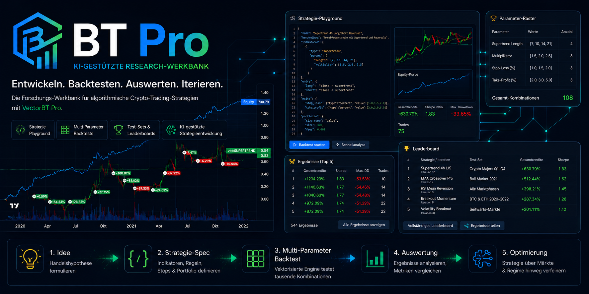
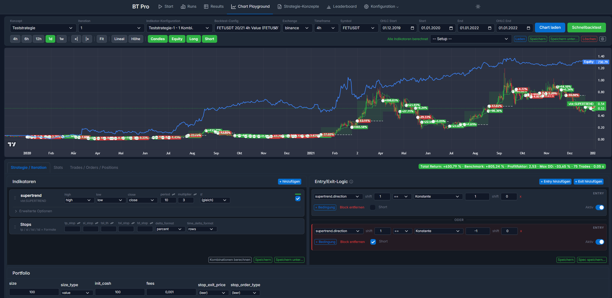
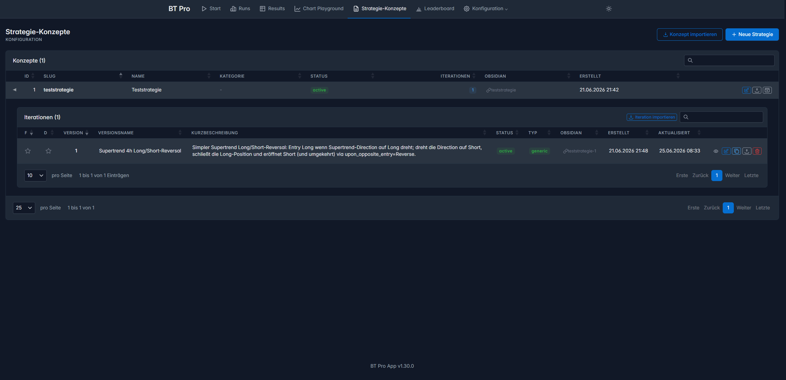
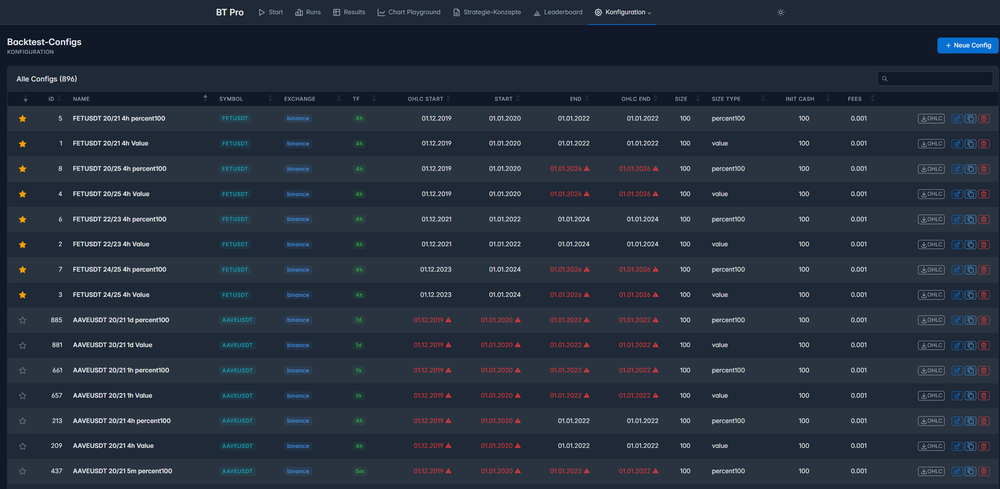
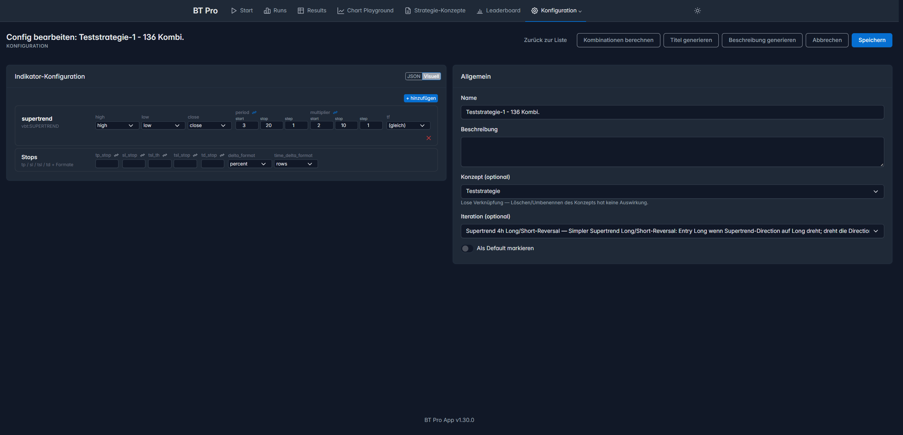
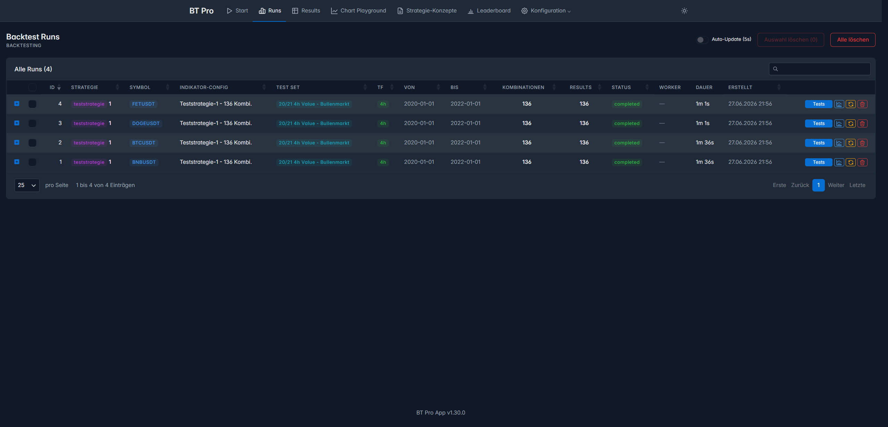
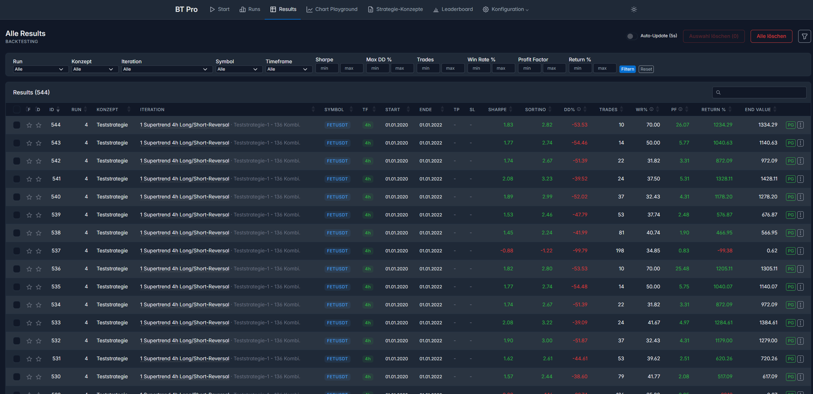
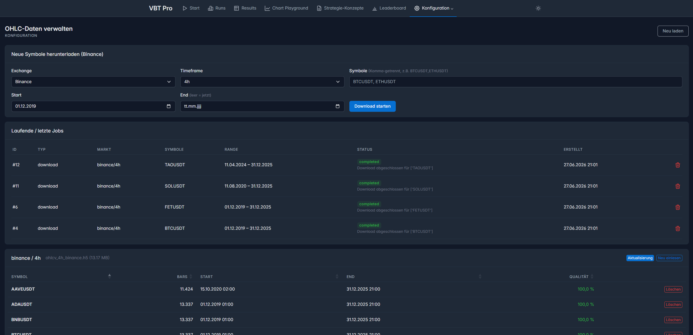
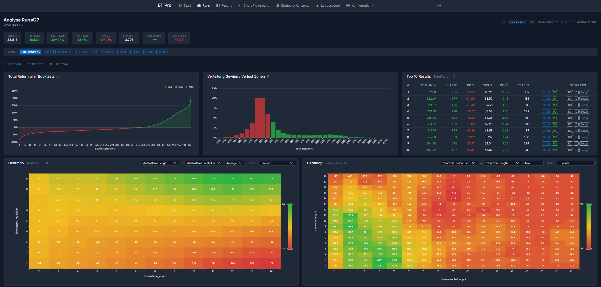

# BT Pro App - Werkbank und GUI für VectorBT Pro

**Research-Werkbank zum iterativen Entwickeln und Backtesten algorithmischer Crypto-Trading-Strategien** — auf Basis von [VectorBT Pro](https://vectorbt.pro/).

Kern-Workflow: Strategie-Idee formulieren → Parameter definieren → Backtest gegen historische Kursdaten ausführen → Ergebnis auswerten → Hypothese verfeinern → wiederholen.

Das eigentliche Ziel ist die **KI-gestützte Strategie-Entwicklung**: Statt jeden Backtest von Hand als Code zu entwickeln, soll man die KI beauftragen: *„Baue eine Strategie aus diesen Indikatoren, das ist das Entry-Signal, das ist das Exit-Signal, und teste sie mit dem Standard-Testset"*. Die KI legt die Strategie an, fährt Multiparameter-Läufe, wertet die Ergebnisse aus und optimiert über Marktphasen und Symbole hinweg. Die App liefert dafür die Werkzeuge (Playground, Test-Sets, Leaderboard), die KI bedient sie.

Die App ist **keine** Trading-Plattform: Sie führt keinen echten Handel aus, hat keinen Broker-Anschluss und kein Live-Order-Management. Sie ist ein Ort, um Strategien zu messen, zu vergleichen und systematisch zu verbessern. Fertig optimierte Strategien gehen an ein separates System zur Live-Ausführung.


## Beispiel-Prompt

Hallo, ich möchte, dass du für mich recherchierst und eine Trendfolge-Strategie für den Handel mit ETH/USDT findest. 
Es muss eine Squeeze-Strategie sein, die Bollinger-Bänder als Basisindikator verwendet — und natürlich kannst du jeden 
weiteren Indikator dazunehmen, den du für sinnvoll hältst.

Die Ergebnisse sollen von Jahresbeginn bis heute eine Sharpe-Ratio von mindestens 1,5 und ein Risiko von 3 % des Kontos pro Trade.
Ich möchte auf dem 30-Minuten-Timeframe handeln. Es ist okay für dich, das 4-Stunden-Timeframe als Anchor-Timeframe (übergeordnetes Timeframe) zu nutzen.

Jedes Mal, wenn du eine Strategie entwickelst, validiere das Ergebnis mit einem statistischen Signifikanztest, bevor du die vollständige 
Strategie schreibst. Fahre nur fort, wenn die Metriken der Strategie eine echte statistische Signifikanz aufweisen.

Du kannst gerne Optimierungen nutzen, um die Ergebnisse zu verbessern. Stelle sicher, dass die Ergebnisse nicht overfitted (überangepasst) sind.
Mache so lange weiter, bis du Strategien findest, die die geforderten Kriterien vollständig erfüllen. Unterbrich mich in der Zwischenzeit nicht mit Rückfragen.

## Die ganze App mit der KI bedienen

Der Beispiel-Prompt oben ist der große Auftrag — aber die KI kann weit mehr als das: **Alles, was du in der Oberfläche anklicken kannst, erledigt sie auch für dich.** Strategien anlegen, Indikatoren und Regeln festlegen, Parameter-Raster aufspannen, Kursdaten laden, Backtests und Test-Set-Läufe starten, Ergebnisse auswerten und vergleichen. Du musst dafür weder die JSON-Spec einer Strategie kennen noch eine Konfiguration von Hand ausfüllen.

**So gehst du vor:**

1. App installieren und starten (siehe [Installation](#installation-lokal)).
2. Deine KI im Projektordner öffnen — Claude Code findet den mitgelieferten Skill von allein, anderen KI-Werkzeugen gibst du den Skill-Ordner mit (siehe [Schritt 4](#4-skill---ki-anbinden)).
3. In deinen eigenen Worten sagen, was du haben oder getestet sehen möchtest. Die KI legt alles Nötige an, startet die Läufe und berichtet dir das Ergebnis.

**Beispiele für Aufträge:**

- *„Lade ETHUSDT und SOLUSDT im 1-Stunden-Timeframe herunter."*
- *„Leg mir eine Strategie an: Einstieg, wenn der RSI(14) unter 30 fällt und der Kurs über der EMA 200 liegt. Ausstieg, wenn der RSI über 70 steigt. Stop-Loss 2 %. Speicher sie mir als Setup."*
- *„Teste die RSI-Längen von 7 bis 21 und die EMA-Längen von 100 bis 300 in 50er-Schritten."*
- *„Leg ein Test-Set mit BTC, ETH und SOL auf 4h an, jeweils von 2022 bis 2024, und lass die Strategie dagegen laufen."*
- *„Zeig mir die fünf besten Kombinationen nach Sharpe mit mindestens 30 Trades."*
- *„Ist das beste Ergebnis statistisch signifikant oder nur Zufall?"*
- *„Vergleich die aktuelle Iteration mit der vorherigen."*
- *„Schau dir das hier an: http://localhost:5570/…"* — du kannst der KI einfach die Adresse einer Seite aus der App geben, sie liest das Objekt dahinter selbst ein.

**Zwei Arbeitsweisen:** Einzelne Aufträge wie oben erledigt die KI Schritt für Schritt und meldet sich danach zurück. Gibst du ihr dagegen ein **Ziel** — wie im Beispiel-Prompt —, arbeitet sie eigenständig in Schleifen: recherchieren, Strategie bauen, testen, bewerten, verbessern, bis das Ziel erreicht ist oder sie begründet aufhört.

Alles, was die KI anlegt, siehst du sofort in der Oberfläche und kannst es dort weiterbearbeiten — und umgekehrt findet die KI alles, was du von Hand angelegt hast.

## Was du mit der App machen kannst

Die Oberfläche ist zum **Ansehen, Prüfen und Vergleichen** gebaut. Das Anlegen überlässt du am besten deiner KI — sie kennt die Indikatoren, ihre Parameter und die Regel-Syntax, die du dafür sonst erst lernen müsstest.

### Setup — die KI legt dir deine Strategie an

Das ist die Standard-Arbeitsweise: Du sagst der KI in deinen Worten, was du testen möchtest, und lässt dir das Ergebnis als **Setup** speichern.

- *„Bau mir eine Strategie für ETHUSDT auf 1h: Einstieg, wenn die EMA 20 die EMA 50 von unten kreuzt und der RSI unter 70 liegt. Ausstieg bei der Gegenkreuzung, Stop-Loss 2 %. Speicher sie mir als Setup."*

Ein Setup hält alles fest, was zur Strategie gehört: Marktdaten, Indikatoren mit ihren Werten, Einstiegs- und Ausstiegsregeln, Stops und die Darstellung im Chart. Jedes Setup hat eine eigene Adresse — du öffnest es im Playground und siehst die Strategie sofort im Chart.

Damit ist das Setup der **Übergabepunkt zwischen dir und der KI** — in beide Richtungen. Hast du im Playground etwas verändert, speicherst du es als Setup und sagst: *„Schau dir Setup 12 an und teste die EMA-Längen durch."*

### Chart Playground — im Chart ansehen und feinjustieren

Im Playground siehst du, was die Strategie tut:

- **Schnellbacktest per Klick:** Die Trades erscheinen direkt im Chart, dazu die Equity-Kurve. So siehst du sofort, ob die Idee überhaupt trägt.
- **Werte ändern und neu rechnen:** Parameter anpassen, einzelne Regelblöcke oder Indikatoren zum Ausprobieren abschalten, Stops verändern — und das Ergebnis direkt wieder im Chart sehen.
- **Darstellung nach Wunsch:** Farbe, Linienstil und Stärke jeder Linie; Kanäle erscheinen als gefülltes Band, Zonen als Flächen. Jeder Indikator kann auf einem eigenen Timeframe rechnen (z.B. 4h-Trendfilter im 30-Minuten-Chart).
- **Werkzeuge im Chart:** Lineal zum Messen von Preisabständen, Long/Short getrennt ein- und ausblendbar, per Pfeil zum nächsten Symbol wechseln.

Natürlich kannst du eine Strategie auch komplett von Hand im Playground zusammenklicken — Indikatoren aus allen Bibliotheken, die VectorBT Pro mitbringt, Regeln mit UND und ODER. Das ist aber mühsam und setzt voraus, dass du die Indikatoren und ihre Parameter gut kennst.

### Indikator-Konfiguration — viele Parameter auf einmal testen

Statt jede Einstellung einzeln auszuprobieren, gibst du für jeden Parameter einen Wertebereich an — z.B. EMA-Länge von 10 bis 100 in 5er-Schritten. Ein **Multiparameter-Lauf** rechnet dann jede Kombination durch, auch die Stops. Die Kombinationen zählt die App vorher für dich. Dank VectorBT Pro geht das schnell: rund 30.000 Kombinationen über zwei Jahre Kursdaten in etwa 15 Minuten.

Die Wertebereiche speicherst du als **Indikator-Konfiguration**, Markt und Portfolio (Symbol, Zeitraum, Startkapital, Positionsgröße, Gebühren) als **Backtest-Konfiguration**. Beide sind unabhängig von der Strategie — dieselbe Strategie lässt sich mit beliebigen Werten und gegen beliebige Märkte rechnen.

### Test-Sets — über Märkte und Zeiträume prüfen

Eine Strategie, die nur auf BTC im letzten Jahr funktioniert, ist wenig wert. Ein **Test-Set** fasst mehrere Backtest-Konfigurationen zusammen — verschiedene Symbole, Bullen- und Bärenphasen, Seitwärtsmärkte — und rechnet deine Strategie mit einem Klick gegen alle unter identischen Bedingungen. Die Grundausstattung bringt fertige Test-Sets mit.

### Ergebnisse auswerten

- **Runs:** alle Läufe mit Status und Fortschritt, laufende und abgeschlossene.
- **Results:** jede einzelne Parameter-Kombination mit Kennzahlen wie Rendite, Sharpe, Drawdown, Profit Factor und Trefferquote — filter- und sortierbar, dauerhaft gespeichert. Gute Ergebnisse markierst du mit einem Stern.
- **Analyse eines Laufs:** Zusammenfassung, Top 10, Verteilung von Gewinnen und Verlusten, Heatmaps (auch als 3D) — so siehst du, ob gute Werte ein stabiles Plateau bilden oder nur ein zufälliger Ausreißer sind.
- **Einzelergebnis im Detail:** Chart mit allen Trades, Equity und Drawdown, vollständige Statistik, Trade-, Order- und Positionslisten. Mit **Walk Forward** prüfst du per Klick, wie dieselben Werte in den folgenden 3, 6 oder 12 Monaten abgeschnitten hätten. Mit „In Playground öffnen“ landest du direkt wieder im Chart.

### Strategien weiterentwickeln und vergleichen

- **Konzepte und Iterationen:** Ein **Konzept** ist deine Trading-Idee, eine **Iteration** eine konkrete Fassung davon. Jede Änderung an der Strategie wird eine neue Iteration mit Verweis auf die vorige — du kannst jederzeit nachvollziehen, welches Ergebnis zu welcher Fassung gehört, und zu einer älteren zurückkehren.
- **Leaderboard:** eine Rangliste, in der du Strategien und Iterationen über lange, vergleichbare Zeiträume gegenüberstellst — sortierbar nach Rendite, Sharpe, Drawdown und mehr. So kommt etwas hinein: Setz beim Test-Set den Haken **„Leaderboard-Eintrag erstellen“**. Jeder abgeschlossene Lauf dieses Test-Sets landet dann automatisch im Leaderboard — mit der besten Parameter-Kombination je Markt und den zusammengefassten Kennzahlen über alle Märkte des Sets.

### Rund um die App

- **Kursdaten:** Beliebige Binance-Symbole und Timeframes herunterladen und aktualisieren, ohne API-Key. Der Download läuft im Hintergrund.
- **Job-Übersicht:** zeigt, welche Worker gerade rechnen und welche Aufträge noch warten.
- **Datenbank-Sicherung:** den aktuellen Stand (Strategien, Konfigurationen, Ergebnisse) mit einem Klick sichern und später zurückspielen.
- **Wissens-Index:** Deine Strategie-Notizen (Obsidian-Vault) werden durchsuchbar gemacht, damit die KI bei neuen Aufträgen auf frühere Erkenntnisse zurückgreifen kann.


*Chart Playground — zentraler Arbeitsbereich*

| | |
|:---:|:---:|
| **Strategie-Konzepte & Iterationen** | **Backtest-Konfigurationen** |
|  |  |
| **Indikator-Konfiguration** | **Runs (Backtest-Läufe)** |
|  |  |
| **Results (Einzelergebnisse, filter- und sortierbar)** | **OHLC-Daten verwalten** |
|  |  |
| **Runs-Analyse (Kennzahlen, Verteilungen, Top-10 & Parameter-Heatmaps)** | |
|  | |

---

## Voraussetzungen

Was du selbst mitbringen musst, damit die App lokal läuft:

- **Docker + Docker Compose.** Standard-Setup ist **Windows mit Docker Desktop** (dafür ist `install.bat` gebaut); Linux/macOS laufen über `install.sh`.
- **Eigene VectorBT-Pro-Lizenz mit GitHub-Zugang** (siehe unten).

### VectorBT Pro — notwendiges externes Framework

**VectorBT Pro ist nicht Teil dieses Repos** und wird auch nicht mit ausgeliefert — es ist ein kommerzielles, kostenpflichtiges Produkt von [vectorbt.pro](https://vectorbt.pro/). Du brauchst eine **eigene VBT-Pro-Lizenz** mit Zugriff auf das private GitHub-Repo `polakowo/vectorbt.pro`. Dieses Repo enthält nur Verweise, die das Framework beim Build aus dem Original nachladen — der Framework-Code selbst muss von dir bezogen werden.

So bekommst du den Zugang:

1. **Lizenz erwerben** unter [vectorbt.pro](https://vectorbt.pro/) — danach wird dein GitHub-Account zum privaten Repo `polakowo/vectorbt.pro` eingeladen.
2. **SSH-Key** bei GitHub hinterlegen, der diesen Zugriff hat (der Build zieht VBT Pro per `git+ssh`).

Das VBT-Framework-Basis-Image wird **separat** gebaut (nicht über Compose — ein Compose-Build mit Build-Secret bricht den buildx-bake-Schritt ab). Der Key wird als BuildKit-Secret übergeben und landet nie im Image:

```bash
# Native Linux/macOS:
services/vbt/build.sh ~/.ssh/<keyname>

# WSL + Docker Desktop (Key über UNC-Pfad, da die Windows-Engine /mnt-Pfade nicht übersetzt):
services/vbt/build.sh '\\wsl.localhost\<Distro>\home\<user>\.ssh\<keyname>'
```

Das erzeugt das Image `bt_pro_app_v1-vbt:latest`, das Compose anschließend als Basis nutzt.

---

## Installation (lokal)

### 1. `.env` anlegen

```bash
cp .env.example .env
```

Die Vorgaben sind so gesetzt, dass das System direkt lokal läuft. Einziger Pflicht-Eintrag: `VBT_SSH_KEY` — der Pfad zum SSH-Key, mit dem das VBT-Pro-Framework beim Build gezogen wird (WSL-Hinweise im Abschnitt [Voraussetzungen](#vectorbt-pro--notwendiges-externes-framework)).

### 2. Installieren

```bash
install.bat           # Windows (Docker Desktop, nativ)
./install.sh          # Linux / macOS
```

Ein Aufruf erledigt alles: VBT-Pro-Basis-Image bauen, Container starten, Datenbank-Schema und Grundausstattung (Backtest-Configs + Test-Sets + Demo-Strategie) anlegen. Die Schema-Anlage läuft automatisch beim Container-Start — kein manueller Migrations-Schritt nötig.

> **Achtung — Frisch-Installation:** `install.sh`/`install.bat` löschen vor dem Neuaufbau die bestehende Datenbank und den App-Zustand (Configs, Strategien, Runs, Leaderboard, Queue, pgAdmin) und fragen vorher zur Sicherheit nach. Kursdaten (`data/ohlc_data`) bleiben erhalten.

### 3. App öffnen

Nach kurzer Startzeit ist die App erreichbar (der App-Container migriert die Datenbank beim Start automatisch):

| Dienst | URL | Beschreibung |
|---|---|---|
| Installations-Übersicht | http://localhost:5570/install | Einstiegspunkt nach der Installation: Installations-Check und Kursdaten laden (siehe Schritt 5) |
| App / Frontend | http://localhost:5570 | Die eigentliche Anwendung: Playground, Konfigurationen, Test-Sets, Leaderboard, Backtest-Auswertung |
| pgAdmin | http://localhost:5563 | Web-Oberfläche zur Verwaltung der PostgreSQL-Datenbank |
| PostgreSQL | localhost:5560 | Direkter Datenbank-Zugang (z.B. für externe Tools) |

### 4. SKILL - KI anbinden

Bedient wird die App von der KI über den mitgelieferten Skill-Ordner **`.claude/skills/ds-strategie-session/`** — darin der Entwicklungs-Loop (`SKILL.md`) und `scripts/toolbox.py`, das jedes App-Objekt (Iterationen, Configs, Runs, Results, Test-Sets, Leaderboard) über die API anlegt, startet und ausliest.

Claude Code findet den Ordner im Projekt-Root von allein; bei anderen KI-Werkzeugen legst du ihn dort ab, wo sie ihre Skills erwarten. Mehr ist nicht nötig: `toolbox.py` braucht nur ein `python3` ohne Zusatzpakete und spricht standardmäßig `http://localhost:5570` an (abweichender Port über `VBT_APP_BASE_URL`).

### 5. Einrichtung abschließen

Öffne die **Installations-Übersicht** unter [http://localhost:5570/install](http://localhost:5570/install):

- **Installations-Check** — zeigt, was die Grundausstattung mitgebracht hat: Backtest-Configs, Test-Sets und eine Demo-Strategie als Einstiegsbeispiel.
- **OHLC laden** — **der erste Weg ist die KI:** sag ihr „Lade BTCUSDT im 4-Stunden-Timeframe herunter“, sie hat die Werkzeuge dazu und erledigt den Download. **Der zweite, manuelle Weg** führt über **Konfiguration → OHLC-Daten**. Der Button hier auf der Installations-Übersicht ist der Schnellstart: Er legt die Download-Jobs für die Symbole der mitgelieferten Test-Sets an (Binance, je Symbol ein Hintergrund-Job; bereits vorhandene Symbole werden übersprungen). Danach sind Backtests und die Demo-Strategie lauffähig.
- **Der erste Backtest dauert länger** — VectorBT Pro kompiliert seine Numba-Rechenfunktionen beim ersten Aufruf und legt sie im Cache ab. Das geschieht getrennt pro Prozess: einmal beim ersten echten Lauf (Run/Result, der asynchron über den Worker läuft) und einmal beim ersten Schnellbacktest im Playground (der synchron im Frontend-Prozess läuft, nicht im Worker). Jeder weitere Lauf im jeweiligen Prozess läuft dann mit voller Geschwindigkeit.

---

## Datenquelle

OHLCV-Daten (Open, High, Low, Close, Volume) werden über den VectorBT-Pro-Downloader von **Binance** geladen (historische Public-Daten, kein API-Key nötig) und als HDF5-Dateien unter `data/ohlc_data/` gespeichert — beim Backtest direkt aus dem Dateisystem gelesen, kein DB-Roundtrip für Kursdaten.

**Dateibesitz im Bind-Mount:** Die HDF5-Dateien werden vom Worker angelegt und anschließend von App und Worker gemeinsam beschrieben (Download, Update, Symbol löschen). Damit das aufgeht, laufen alle Container, die `data/ohlc_data`, `user_data` oder `services` beschreiben, als `uid:gid 1000:1000` — das ist in `docker-compose-local.yml` gesetzt (`app`, `worker`, `worker-init`, `vbt`). Liefe auch nur einer davon als root, entstünden `root:root`-Dateien mit Modus 644, die die anderen Container nicht mehr beschreiben können (Fehlerbild: „file … exists but it can not be written"). Passt dein Host-Benutzer nicht auf 1000:1000 (`id -u` / `id -g`), trage deine Werte dort ein.

Sind bereits `root`-eigene Dateien im Mount gelandet (z.B. aus einer älteren Installation), einmalig geradeziehen:

```bash
docker exec -u 0 frontend_bt_pro_v1 chown -R 1000:1000 /app/data/ohlc_data /app/user_data /app/services
```
---

## Technische Referenz

### Tech-Stack (im Container)

Diese Komponenten musst du nicht selbst installieren — sie stecken in den Docker-Containern. Reine Nachschlage-Info:

| Komponente | Technologie |
|---|---|
| Backend | Python 3.13 + FastAPI |
| Backtest-Engine | VectorBT Pro |
| Datenbank | PostgreSQL 17 + TimescaleDB + pgvector |
| Job-Queue | Redis + RQ |
| Frontend | Tabler (Bootstrap 5) + DataTables + LightweightCharts |
| Container | Docker Compose |

### Architektur (Kurzüberblick)

```
Browser ── HTTP ──> FastAPI (app) ──> PostgreSQL/TimescaleDB
                         │
                         └── Redis-Queue ──> RQ-Worker ──> Spec-Runner
                                                              │
                                  OHLCV (HDF5) ──────────────┘
```

Ablauf eines asynchronen Backtests: Setup definieren → `POST /api/backtest/start` → FastAPI legt `BacktestRun` an und stellt den Job in die Redis-Queue → RQ-Worker führt den Spec-Runner aus (OHLCV laden → Indikatoren berechnen → Regeln auswerten → `Portfolio.from_signals`) → Ergebnisse in PostgreSQL → Frontend pollt den Status. Der Schnellbacktest im Playground (`POST /api/chart-playground/run-backtest-lite`) rechnet dagegen synchron und ohne DB-Schreibvorgang — für die schnelle visuelle Prüfung direkt im Chart.

Services (`docker-compose-local.yml`): `vbt` (Framework-Basis-Image), `app` (FastAPI), `worker` (RQ), `scheduler` (Reindex-Jobs), `db` (PostgreSQL/TimescaleDB), `redis` (Queue), `pgadmin`.

### Projektstruktur

```
services/api/        FastAPI-Backend (Routes, Schemas, Worker-Tasks)
services/vbt/        VBT-Framework-Basis-Image + Knowledge-Indexer
services/frontend/   Tabler/DataTables Templates + Static
services/scheduler/  Scheduler (Reindex-Jobs)
user_data/           Strategie-Definitionen, Spec-Runner, Custom-Indikatoren
tests/               pytest-Suite
alembic/             DB-Migrationen
documentation/       Projekt-, Knowledge-, Changelog- und Git-Doku
```

---

## Weiterführende Dokumentation

| Dokument | Inhalt |
|---|---|
| `documentation/project/projekt.md` | Ausführliches Projektbriefing (Zweck, Funktionsumfang) |
| `CHANGELOG.md` | Release-Historie |

---

## Out of Scope

Live-Trading / Order-Execution, Multi-Tenant / User-Accounts, Produktions-Trading mit Risk-Management. Die App ist bewusst eine Single-User-Research-Werkbank.

---

## Haftungsausschluss

BT Pro App ist ein **experimentelles Forschungswerkzeug** zur Entwicklung und zum Backtesting von Trading-Strategien. Es dient ausschließlich Bildungs- und Experimentierzwecken und stellt **keine Anlageberatung** dar.

Alle erzeugten Strategien und Kennzahlen beruhen auf **simulierten bzw. hypothetischen Backtest-Ergebnissen**. Diese bilden kein echtes Handelsgeschehen ab und können von der Realität erheblich abweichen: Sie werden mit dem Vorteil der Rückschau („hindsight") erstellt und berücksichtigen Faktoren wie fehlende Liquidität, Slippage oder Ausführungsverzögerungen nicht oder nur unvollständig.

**Vergangene oder simulierte Wertentwicklung ist kein verlässlicher Indikator für zukünftige Ergebnisse.** Der Handel mit Finanzinstrumenten ist mit erheblichen Verlustrisiken verbunden.

Die Nutzung erfolgt vollständig auf eigenes Risiko. Es wird **keinerlei Garantie** für Richtigkeit, Vollständigkeit oder Eignung der Ergebnisse übernommen, und es wird **keine Haftung** für Handelsverluste oder sonstige Schäden übernommen, die aus der Nutzung dieser Software oder der damit entwickelten Strategien entstehen.

---

## Drittanbieter

- **Lightweight Charts™** © TradingView, Inc. — Charting-Bibliothek unter Apache License 2.0, eingebunden über CDN. Die Charts zeigen das TradingView-Attributionslogo mit Link auf [tradingview.com](https://www.tradingview.com/). Vollständige Hinweise: [`NOTICE`](NOTICE).
- **Apache ECharts** © The Apache Software Foundation — Charting-Bibliothek (Analyse-Ansicht) unter Apache License 2.0, eingebunden über CDN. Siehe [echarts.apache.org](https://echarts.apache.org/) und [`NOTICE`](NOTICE).
- **TimescaleDB** © Timescale, Inc. — als Datenbank-Erweiterung genutzt (Container-Image). Der Kern steht unter Apache 2.0, einige Features unter der **Timescale License (TSL)** — „source available", **nicht** OSI-Open-Source. Selbsthosting und Eigennutzung sind erlaubt; das Anbieten von TimescaleDB als Database-as-a-Service für Dritte ist untersagt. Siehe [Timescale License](https://github.com/timescale/timescaledb/blob/main/tsl/LICENSE-TIMESCALE).
- **psycopg2-binary** © Federico Di Gregorio u.a. — PostgreSQL-Treiber, genutzt als pip-Abhängigkeit unter **LGPL v3**. Der Quellcode ist öffentlich und das Modul per `pip` austauschbar; eigener Projektcode ist davon nicht betroffen. Siehe [psycopg2](https://github.com/psycopg/psycopg2).
- **Font Awesome Free** © Fonticons, Inc. — Icon-Bibliothek, eingebunden über CDN. Die Icons stehen unter **CC BY 4.0** (Namensnennung erforderlich), der Code unter MIT, die Fonts unter SIL OFL 1.1. Siehe [fontawesome.com](https://fontawesome.com/).

---

## Lizenz

Dieses Projekt steht unter der **Apache License 2.0** — siehe [`LICENSE`](LICENSE).

Die Lizenz deckt ausschließlich den Code **dieses** Repos. **VectorBT Pro ist davon nicht erfasst**: Es ist ein separates, kommerzielles Produkt unter eigener Lizenz und liegt nicht im Repo (siehe [Voraussetzungen](#vectorbt-pro--notwendiges-externes-framework)). Jede Nutzung von VBT Pro erfordert eine eigene gültige Lizenz.
